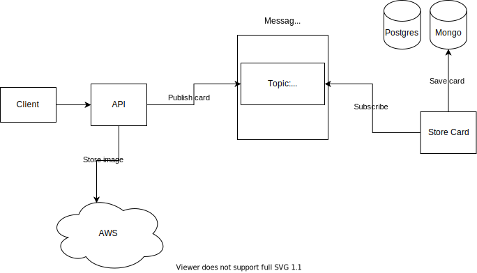

# Introduction

This is the backend service to store cards into a NOSQL database

# Quickstart

Make sure to fill up the environment variables. A template is located under /config/env/template.yaml. Copy this template and set the environment values. Then rename it as "dev.yaml" so it can be read by the application.

Run `docker-compose up --build` to start the application.

The server is located on port :8080
The mongo database is accessible on port :27017. The 2 services are connected on the same bridge using the service name to connect.

The swagger documentation can be found under

- localhost:8080/swagger/index.html

# Swagger

To generate swagger documentation, make sure to have swaggo cli.

`go get -u github.com/swaggo/swag/cmd/swag`.

Then run `swag init` to start generating the documentation. The generated files are located under /docs from the root directory.
